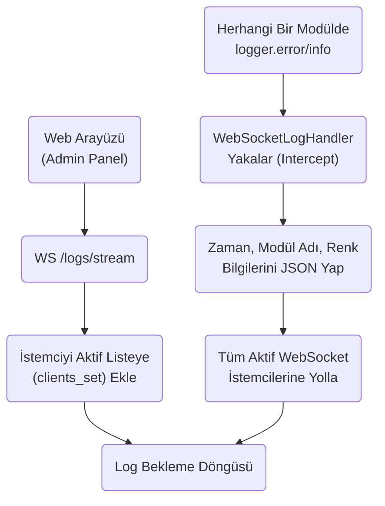
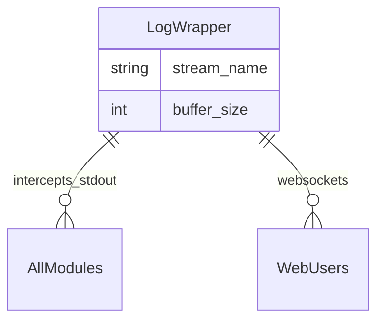

# LogWrapper Modülü Mimarisi

LogWrapper modülü (`modules/logwrapper`), sistem genelindeki standart `logger` (logging) akışlarını toplayarak, hem konsola renkli bastıran (rich tabanlı) hem de WebSocket üzerinden web paneline anlık olarak (canlı log streaming) ileten merkezi log yakalayıcısıdır.

## 🏗️ İş Akışı ve Karar Mekanizmaları (Flowchart)

## 🔄 İlişkisel Etkileşimler (Veri Akışı)

## ⚙️ Detaylı Karar Mantığı (if/else)

1. **İstemci (Client) Yönetimi**
   - Web üzerinde log izleyen ekran kapatılırsa (veya tarayıcı çökerse), WebSocket bağlantısı kopar.
   - **`try / except WebSocketDisconnect`**: Bu durumda sistemdeki aktif bağlantı kümesinden (`clients.remove(ws)`) istemciyi derhal siler. Bu işlem yapılmazsa, bir sonraki `logger.info("Merhaba")` çağrıldığında sistem ölü bir sokete veri yazmaya çalışıp çöker.
2. **Buffer (Kuyruk) Mekanizması**
   - **`if`** aktif hiçbir WebSocket bağlantısı yoksa loglar uzaya gitmez, küçük bir "Son N log" değişken dizisinde tutulmaya devam edebilir (Eski logları paneli açar açmaz görebilmek için geçmiş log belleği (History Buffer) kullanımı).
