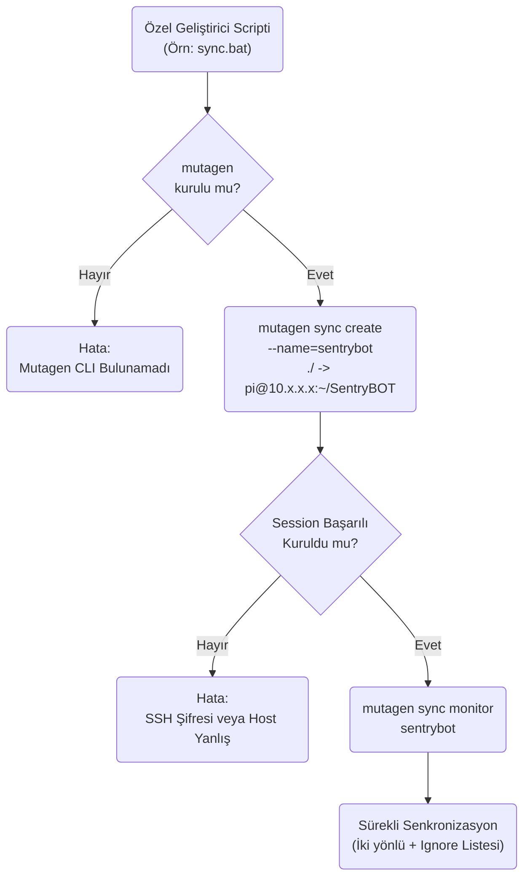
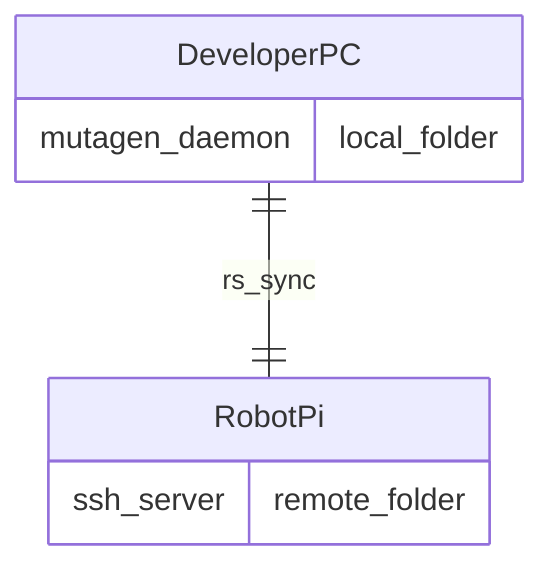

# Mutagen Modülü Mimarisi

Mutagen modülü (`modules/mutagen`), geliştiricinin bilgisayarı (Windows/Mac) ile robot (Raspberry Pi/Jetson) arasında klasörleri canlı olarak eşzamanlayan `mutagen` aracını sarmalayan (wrap eden) komut satırı hizmetidir.

## 🏗️ İş Akışı ve Karar Mekanizmaları (Flowchart)

## 🔄 İlişkisel Etkileşimler (Veri Akışı)

## ⚙️ Detaylı Karar Mantığı (if/else)

1. **Ignore (Yok Sayılanlar) Mantığı**
   - Karşıya `.git`, `__pycache__`, `venv` ve SQLite veritabanları (Çünkü veritabanları rsync gibi canlı sync edilmeye çalışıldığında kilitlenir) gibi dosyaların kopyalanması **`if ignored`** kuralıyla engellenir. Bu konfigürasyon `mutagen.yml` içerisinde tutulur.
2. **Çarpışma (Conflict) Çözümü**
   - İki tarafta da aynı anda `config.yml` değiştirildiyse (Robot üzerinden web panelle değiştirildi, Bilgisayarda VS Code ile değiştirildi), Mutagen'in varsayılan kopyalama davranışı `resolve: remote-wins` (robotun bilgisini ezme) veya `local-wins` (kod yazan adamın ezmesi) kuralına göre önceliklendirilir.
