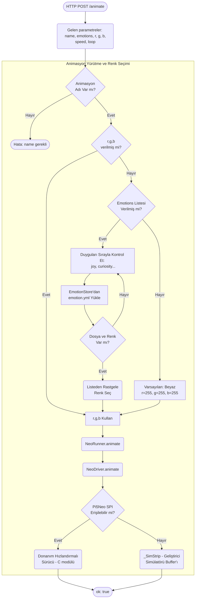
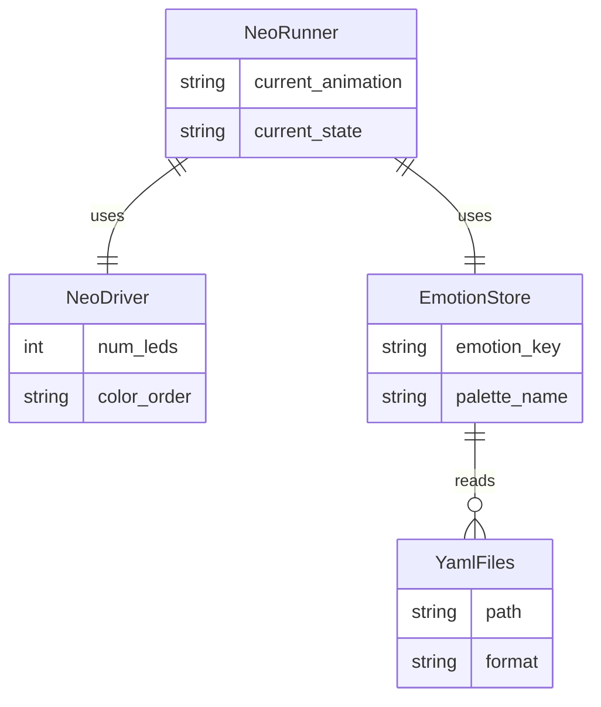

# NeoPixel Modülü Mimarisi

NeoPixel modülü (`modules/neopixel`), robotun göz veya gövde ışıklarını (WS2812/SK6812 LED şeritleri) kontrol eder. 20'den fazla yerleşik animasyon barındırır ve duygu durumlarına (joy, fear, neutral vb.) göre 23 farklı YAML paletinden renk eşleştirmesi yapar.

## 🏗️ İş Akışı ve Karar Mekanizmaları (Flowchart)

Bir animasyon veya renk değiştirme isteği geldiğinde, sistemin bunu donanıma (`pi5neo` veya `_SimStrip`) nasıl aktardığını gösteren diyagram:

## 🔄 İlişkisel Etkileşimler (Veri Akışı)

## ⚙️ Detaylı Karar Mantığı (if/else)

1. **Renk Seçimi (`resolve_colors`)**
   - Animasyon başlatılmadan önce renklerin belirlenmesi gerekir.
   - **`if`** `r,g,b` değerleri istekte API üzerinden açıkça verilmişse, doğrudan bu değerler kullanılır (Kullanıcı veya Autonomy belirli bir renk dayatmış demektir).
   - **`else if`** `emotions` listesi mevcutsa (örn: `["joy", "curiosity"]`), sistem `loader.py` üzerinden 23 YAML duygu paletine (`emotions/*.yml`) bakar. İlk bulduğu geçerli duygu dosyasından listelenmiş HEX veya RGB listesinden `random.choice()` ile rastgele bir renk seçer (böylece robot her mutlu olduğunda farklı, ama mutlu hissettiren sıcak renkler yanar).
   - **`else`**: Beyaz renk atanır `(255, 255, 255)`.
2. **Sürücü Seçimi (`NeoDriver.__init__`)**
   - Başlatma sırasında donanım sürücüsü seçilmek zorundadır.
   - **`try`**: `from pi5neo import Pi5Neo` yapmayı dener. Eğer kütüphane yüklüyse ve `/dev/spidev` portu açıksa donanım (C) tabanlı SPI sürücüsüne bağlanır.
   - **`except Exception`**: Windows, Mac veya SPI pinleri kapalı bir RPi üzerinde çalışıyorsa sistemin çökmemesi için `_SimStrip` isimli sahte (dummy) sınıfı yükler. Bu sınıf LED'lerin o anki RGB durumlarını sadece RAM'de tutar, LED'lere gerçekte bir data yollamaz ama diğer modüller hata almadan çalışmaya devam eder.
3. **Animasyon Durum Yönetimi**
   - Aynı animasyon üst üste istenirse donanımı gereksiz yormamak için **`if`** `current == requested`: görmezden gelinir.
   - `loop=True` ise donanım animasyonu kendi iç döngüsüne (sonsuz) alır; değilse belirli `iterations` kadar (örn: 3 kez nefes) yapar ve biter.
