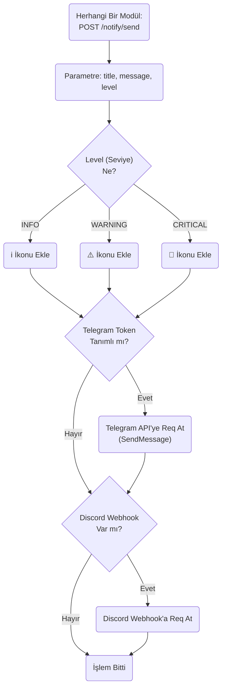
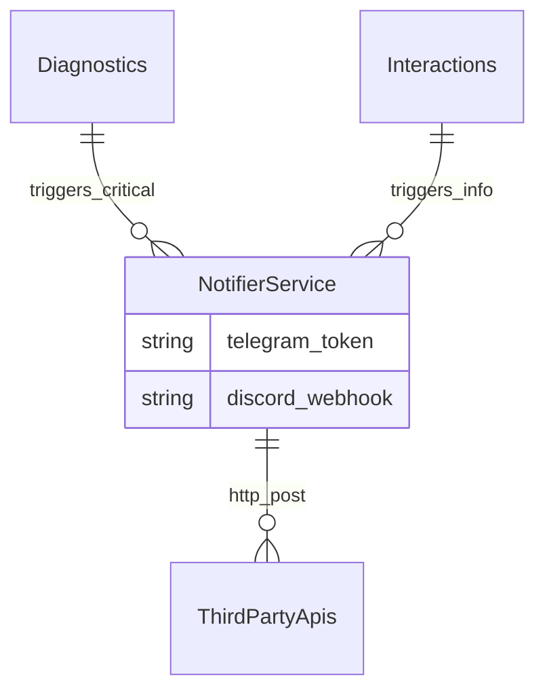

# Notifier (Bildirim) Modülü Mimarisi

Notifier modülü (`modules/notifier`), robottaki önemli olayları veya hataları sahibinin cep telefonuna (Telegram, Discord, Slack) webhook'lar üzerinden güvenli olarak iten (push notification) köprü servisidir.

## 🏗️ İş Akışı ve Karar Mekanizmaları (Flowchart)

## 🔄 İlişkisel Etkileşimler (Veri Akışı)

## ⚙️ Detaylı Karar Mantığı (if/else)

1. **Ağ Çökmesi Koruması**
   - Robot internetsiz bir alana girdiğinde (örneğin fuar alanı), Telegram bildirimleri patlayacaktır.
   - Bu modül içindeki tüm HTTP POST işlemleri **`try / except requests.exceptions.RequestException`** bloğu ile sarmalanır. Ağ yanıt vermezse (`Timeout`), fonksiyon uygulamayı kitlemeden `"Bildirim Gönderilemedi"` iç logunu (logger.error) basıp çıkar.
2. **Kuyruklama ve Taşkın (Flood) Önleme**
   - Saniyede 100 kere `CRITICAL` hatası çıkarsa robota ait Telegram API adresi spam sebepli banlanacaktır.
   - Bildirimler gönderilirken, son 10 saniye içinde **`if`** "Aynı Bildirim Gönderildiyse" o bildirimi engeller (Rate Limiting).
