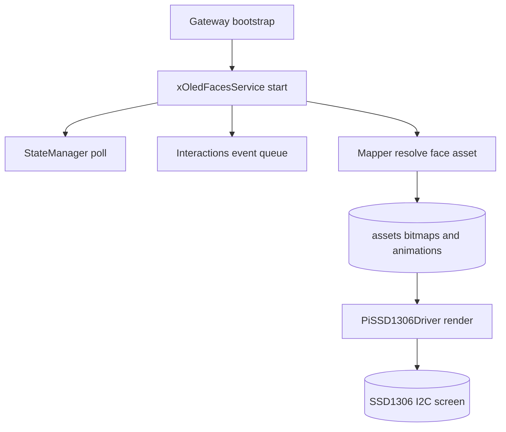
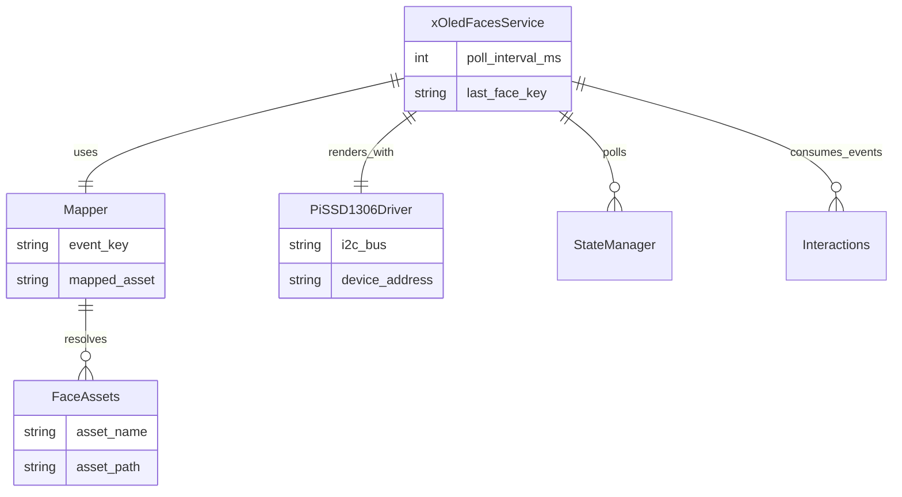

# Architecture – OLED Faces

## Amaç
`Irisoled` bitmap/animasyonlarını robotun anlık durumlarına bağlayarak SSD1306 ekranda ifade üretmek.

## Bileşenler
- `xOledFacesService`: servis yaşam döngüsü, state polling, event işleme
- `services/mapper.py`: olay/durum -> bitmap/animasyon eşleme
- `services/pi_ssd1306_driver.py`: Pi I2C SSD1306 sürücüsü (doğrudan render)
- `api/router.py`: manuel kontrol ve gözlem endpointleri
- `config/config.yml`: eşleme tabloları

## Veri Akışı
1. Gateway `bootstrap`, `xOledFacesService` örneğini oluşturur.
2. Servis periyodik olarak `state_manager` store'dan state çeker.
3. `interactions` event handler ile olaylar canlı iletilir.
4. Servis bitmap/animasyon varlıklarını diskten yükler.
5. Render, Raspberry Pi üzerinde SSD1306 I2C hattına doğrudan gönderilir.

## Mermaid Veri Akışı

## Mermaid Bileşen İlişkileri

## Tasarım Kararları
- State ve event kaynakları ayrıştırıldı; mapping tek noktada yönetiliyor.
- Bilinmeyen olaylar için deterministic fallback (hash tabanlı bitmap seçimi) kullanılıyor.
- Arduino OLED transport bağımlılığı kaldırıldı; OLED tek sahipliği Pi tarafında.

## Genişletme
- `config.yml` üzerinden yeni event/state eşlemeleri eklenebilir.
- Yeni animasyon adları `assets/animations/*.json` dosyalarıyla eklenebilir.
