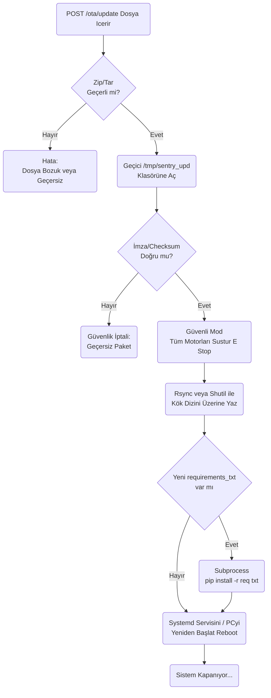

# OTA (Over The Air) Modülü Mimarisi

OTA modülü (`modules/ota`), robotun kablosuz olarak uzak sunucudan (veya yerel olarak yüklenen bir ZIP dasyasından) yazılım güncellemelerini almasını, bunları ayrıştırmasını, dosyaları ezmesini ve güvenli bir restart sağlamasını kontrol eder.

## 🏗️ İş Akışı ve Karar Mekanizmaları (Flowchart)



## 🔄 İlişkisel Etkileşimler (Veri Akışı)

```mermaid
erDiagram
    OTAService ||--|| ArduinoSerial : sends_estop
    OTAService ||--|| LinuxOS : runs_shell_comands
    
    OTAService {verify_package
        apply_update
        system_reboot}
```

## ⚙️ Detaylı Karar Mantığı (if/else)

1. **Safety / E-Stop Mecburiyeti**
   - Robot çalışırken (örneğin yürüme komutları gidiyorken) programın beynini aniden yenilemeye çalışmak (veya reset atmak) robotun denge kaybetmesine, motorların kilitli kalıp yanmasına sebep olabilir.
   - Bu yüzden dosya değiştirme evresine (Overwrite) geçmeden hemen önce **ilk kural** Arduino'ya tüm servo torklarını boşa çıkarma komutu (`robot_command: home/zero/relax`) atamaktır.
2. **Paket Bütünlüğü (Checksum / Sig)**
   - Atılan ZIP dosyası ağ yüzünden yarım inmiş olabilir. `manifest.json` dosyasındaki hash ile arşivin gerçek hash'i karşılaştırılır. **`if`** eşleşmezse, yarı inmiş ve bozuk Python dosyalarının orijinal kodları ezmesini ve SentryBOT'u çöp etmesini engellemek için iptal (`Abort`) atılır.
