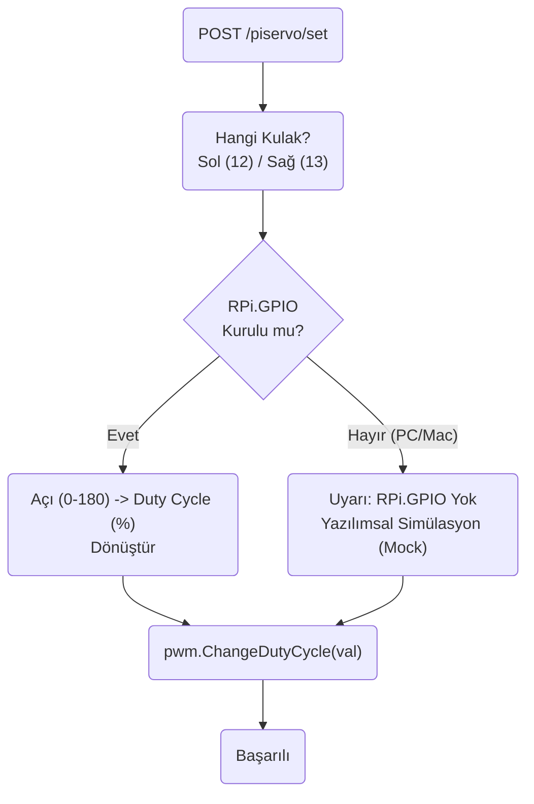

# PiServo Modülü Mimarisi

PiServo modülü (`modules/piservo`), Arduino'ya harici olarak bağlanamayan veya gövdeden bağımsız kafada (Raspberry Pi üzerinde) bulunan özel donanımları (Örn: Kulak servoları) doğrudan Pi'nin GPIO PWM pinleri üzerinden kontrol eden sınıftır.

## 🏗️ İş Akışı ve Karar Mekanizmaları (Flowchart)



## 🔄 İlişkisel Etkileşimler (Veri Akışı)

```mermaid
erDiagram
    PiServoService ||--|| RPi_GPIO : uses_hardware_pwm
    AutonomyBrain ||--o{"PiServoService : sends_custom_gestures
    
    PiServoService {
        set_angle_pin__angle"}
```

## ⚙️ Detaylı Karar Mantığı (if/else)

1. **İşletim Sistemi Bağımlılığı (Mock/Simülator)**
   - Bu proje bilgisayarda (Windows/Mac) test edilirken `RPi.GPIO` kütüphanesini `import` etmek çökmeye neden olur. Modül çalışmaya başladığında **`try / except ImportError`** kullanır. **`if`** Raspberry Pi donanımı yoksa `self.pwm = None` kalır ve gelen tüm açı komutlarını sadece konsola (`logger.info("Mock Servo 90")`) yazdırıp sistemi çökertmekten kurtarır.
2. **Görev Döngüsü (Duty Cycle) Dönüşümü**
   - SG90/MG996 tarzı servolar 50Hz (20ms) periyotta çalışır.
   - Açıyı (0-180 derece) direkt 0-100% PWM pulslarına çevirme formülü işletilir. Standart bir 2ms pals %10 duty'e denk gelir. **`if`** açı 180'den büyük veya 0'dan küçük girilmişse güvenli sınırlar (Clamp) uygulanıp motora fiziksel hasar verilmesi engellenir.
