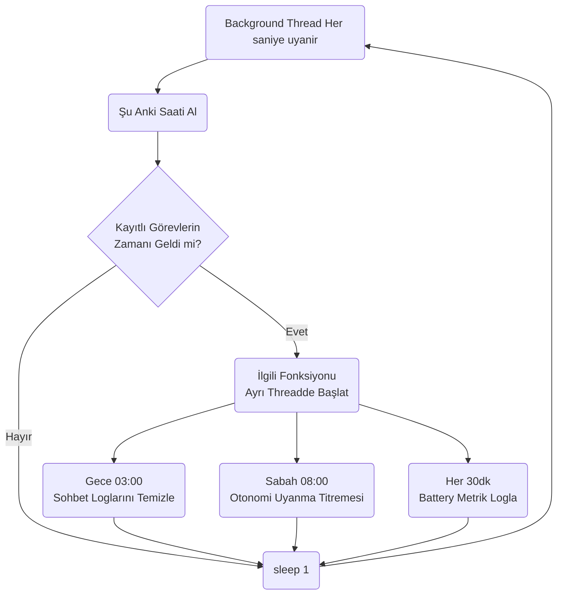
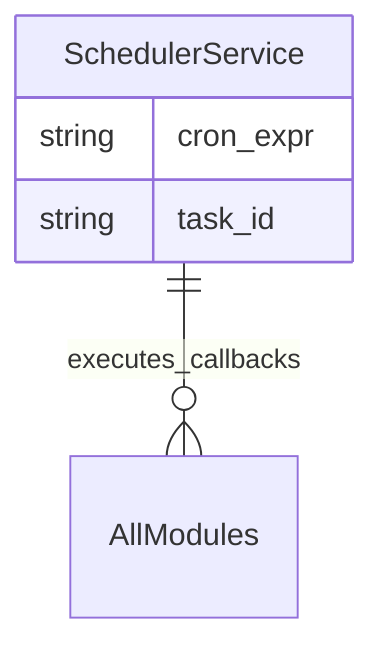

# Scheduler Modülü Mimarisi

Scheduler modülü (`modules/scheduler`), robotun arka planda her 1 dakika, saat başı veya gece 3'te yapması gereken zamanlanmış görevleri (Cron mantığı) yürüten ve yöneten servistir.

## 🏗️ İş Akışı ve Karar Mekanizmaları (Flowchart)

## 🔄 İlişkisel Etkileşimler (Veri Akışı)

## ⚙️ Detaylı Karar Mantığı (if/else)

1. **Zamanlanmış Olarak Görev Tetikleme (Cron Parser)**
   - Modül içinde Python `schedule` kütüphanesi sarmalanır.
   - **`if`** bir komut/algoritma bloklanıyorsa (Örneğin "Logları buluta yedekleme" işlemi 5 dakika sürüyorsa), ana scheduler thread'inin donup diğer zamanlanmış görevleri (Örn: Alarm çalma) kaçırmaması için **her çalışan fonksiyon** yeni bir `threading.Thread(target=func).start()` bloğu içine alınır. Bu "Non-blocking" mimaridir.
