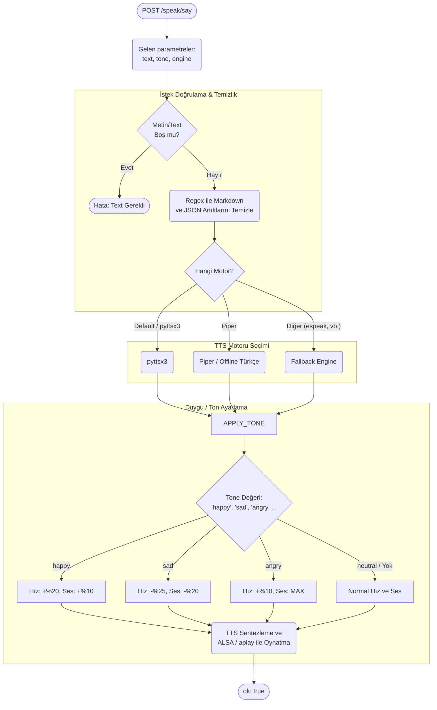

# Speak (TTS) Modülü Mimarisi

Speak modülü (`modules/speak`), metinden sese dönüştürme (Text-to-Speech) işlemini gerçekleştirerek robotun fiziksel hoparlöründen konuşmasını sağlar.

## 🏗️ İş Akışı ve Karar Mekanizmaları (Flowchart)



## 🔄 İlişkisel Etkileşimler (Veri Akışı)

```mermaid
erDiagram
    AutonomyBrain ||--o{"SpeakService : generates_speech
    VisionBridge ||--o{ SpeakService : pushes_alerts
    
    SpeakService {
        string default_engine
                float base_rate
                say_text__tone"}
```

## ⚙️ Detaylı Karar Mantığı (if/else)

1. **Metin Temizliği (Regex)**
   - Autonomy'den gelen LLM cümlesi yanlışlıkla markdown yıldızları (`*hızla kafa sallar*`), etiketler (`<speak>`) barındırıyorsa, okumadan önce Regex ile bunları temizler (`re.sub` mantığı). Aksi takdirde TTS motoru harf harf "yıldız gülücük yıldız" şeklinde okur.
2. **Tone (Duygu) Ayarlamaları**
   - Autonomy Brain, robotun hissettiği duyguya (joy, sadness) göre `tone` parametresini doldurur.
   - **`if`** `tone == 'sad'`: Hoparlörün okuma hızı (rate) düşürülür, ses (volume) azaltılır, böylece mutsuz bir tını oluşur.
   - **`if`** `tone == 'happy'`: Cümle ritmik ve daha hızlı, sesi daha gür çıkar.
3. **Motor Seçimi (`pyttsx3` vs `piper`)**
   - **`if`** `engine == 'piper'`: RPi üzerinde yüksek kaliteli yerel insan sesi sentezleyen piper binary'sini (`subprocess` ile) çalıştırıp `aplay` (ALSA ses sistemi) portuna pipe eder.
   - **`else`**: Basit ama uyumlu olan standart `pyttsx3` nesnesi (runAndWait) çağrılır.
