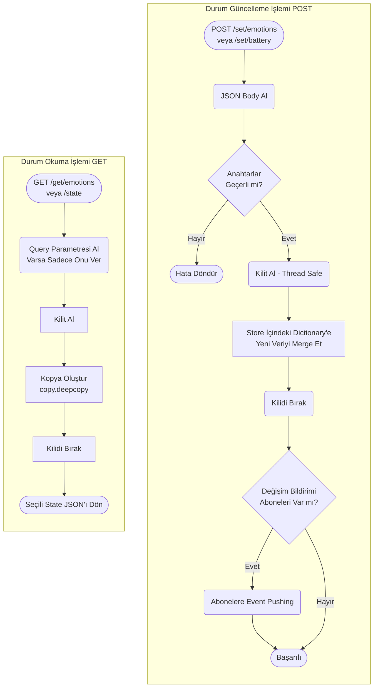
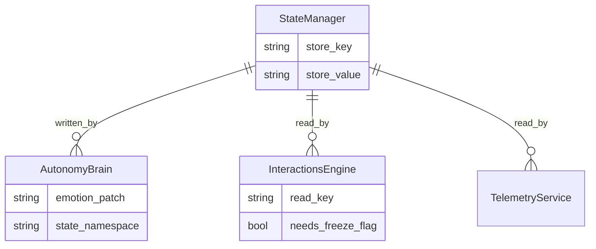

# State Manager Modülü Mimarisi

State Manager modülü (`modules/state_manager`), SentryBOT platformundaki birbiriyle izole çalışan mikroservislerin (Vision, Speech, Autonomy, Arduino vs.) ortak durum (global state) verilerini, örneğin anlık pil seviyesi, genel duygu (emotion) durumu, kilit/donma bayraklarını sakladığı, dağıtık sistemlerdeki "Redis" benzeri in-memory Data Store yapısıdır.

## 🏗️ İş Akışı ve Karar Mekanizmaları (Flowchart)

Diğer tüm modüller bu servise GET/POST atarak durumu yazar veya sorgular.

## 🔄 İlişkisel Etkileşimler (Veri Akışı)

## ⚙️ Detaylı Karar Mantığı (if/else)

1. **Thread/Concurrency (Eşzamanlılık) Kilidi**
   - Gateway aynı anda 10 farklı module API hizmeti verirken (aynı anda hem Telemetry veriyi okuyor, hem de Autonomy veriyi düzeltiyor olabilir). Python dictionary'leri thread-safe olmadığından, her okuma ve yazma kararı önce `threading.Lock()` alır (`with self.store_lock:`). Aksi takdirde robot state bozulması "Race Condition" yaşar.
   - **`if`** Okuma ise, kilit anında tüm sözlüğün derin kopyası oluşturulup kilitten çıkılır (diğer thread'leri bekletmemek için).
2. **Varsayılan Değerler ve Kısmi Güncelleme (Partial Merge)**
   - API'ye (örneğin `/set/emotions`) sadece `{"happiness": 90}` gelirse;
   - Sistem **`if`** mevcut bir "emotions" anahtarı varsa öncelikle bunu alır `{"fear":10, "curiosity":50...}`, üzerine sadece `happiness`'i yazar, geri kalanı korur. (Komple ezme/overwrite yapmaz). Sonrasında kaydeder.
   - Tüm yazılım parçaları kararlarını almadan önce (Örn: Vision kişi selamlarken "Robotun modu uygun mu?") önce bu servisi sorar. Yorgunsa (`energy < 20`) selamlama iptal edilebilir.
