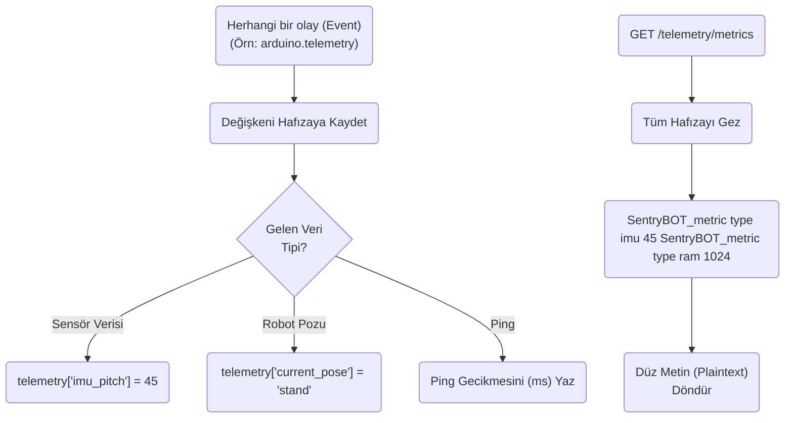

# Telemetry Modülü Mimarisi

Telemetry modülü (`modules/telemetry`), robotun çalışma zamanı sensör verilerini (IMU pitch/roll, ultrasonik mesafe, RAM, CPU durumu) Promethus tarzı grafik araçları veya canlı grafiker ekranlar için toplayan (aggregator) ve dışarı yayınlayan motor modülüdür.

## 🏗️ İş Akışı ve Karar Mekanizmaları (Flowchart)



## 🔄 İlişkisel Etkileşimler (Veri Akışı)

```mermaid
erDiagram
    TelemetryService ||--o{"StateManager : reads
    TelemetryService ||--o{ ArduinoSerial : listens_events
    PrometheusServer ||--|| TelemetryService : scrapes
    
    TelemetryService {
        dict current_metrics
        export_metrics_text"}
```

## ⚙️ Detaylı Karar Mantığı (if/else)

1. **Sürekli Dinleme (Event Listener)**
   - Telemetry saniyede bir Arduino'ya gidip "IMU verin kaç?" diye sormaz (Bu çok fazla trafik yaratır).
   - Onun yerine Arduino tarafı (eğer aktifse) seri porttan `<TLM> ...` formatında JSON fırlatır. Gateway veya Interactions bunu yakalayıp global Event atar (`arduino.telemetry.tick`).
   - Bu modül arka planda bu event gelince `telemetry_dict` değişkenini günceller.
2. **Prometheus Tip Çeviricisi**
   - Prometheus metrikleri sadece "Sayı" (Float/Int) kabul eder.
   - **`if`** hafızadaki değer metin ise (`current_pose = 'sit'`), onu metrik olarak çeviremeyeceği için Prometheus'a eklemez.
