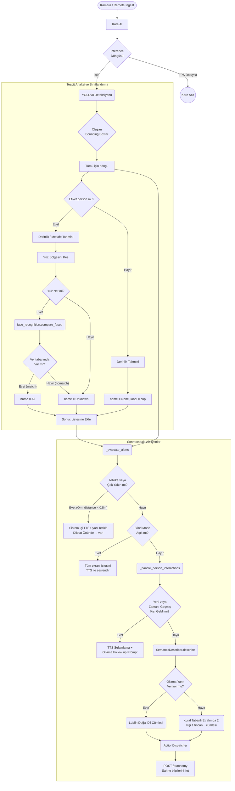

# Vision Bridge Modülü Mimarisi

Vision Bridge modülü (`modules/vision_bridge`), robotun görsel algısını (kamera akışını) işler. YOLO ile nesne tespiti, `face_recognition` ile yüz tanıma yapar, görme engelliler için özel bir mod barındırır ve edindiği anlık görüntü verisini "semantic" (anlamsal) bir dille LLM sistemlerine ulaştırır.

## 🏗️ İş Akışı ve Karar Mekanizmaları (Flowchart)

Görüntünün alınmasından, yüzlerin çıkarılmasına, tehlikeli objelerin TTS ile seslendirilmesine ve sistem özetinin oluşturulmasına kadar olan detaylı if/else adımları:



## 🔄 İlişkisel Etkileşimler (Veri Akışı)

```mermaid
erDiagram
    VisionProcessor ||--|| FaceManager : uses
    VisionProcessor ||--|| SemanticDescriber : uses
    VisionProcessor ||--|| VisionActionDispatcher : pushes
    SemanticDescriber ||--|| PeopleMemory : uses
    
    FaceManager {file faces.json
                load_faces
                identify_face_encoding}

    SemanticDescriber {llm_interval_s int
                get_summary_objects}

    VisionActionDispatcher {"string autonomyUrl 'http://localhost:8080/autonomy/scene'
                emit_scene"}

    PeopleMemory {"file people_memory.json
        dict last_seen 'Örn: { 'Ali': 1710101010"}"
    }
```

## ⚙️ Detaylı Karar Mantığı (if/else)

1. **İnference (YOLO) Hız Kontrolü (FPS Limit)**
   - **`if`** `time.time() - last_inference_time < 1.0 / target_fps`: Gelen kareleri işlemeyi atla. Motoru (RPi 5 / Jetson) gereksiz yere ısıtmamak için sadece belirli aralıklarla (`target_fps` genelde saniyede 5) çıkarım (inference) yapılır.
2. **Yüz Tanıma ve Match (Eşleşme) Mantığı**
   - **`if`** Nesne `person` etiketindeyse, bounding-box'ın üst kısmının (1/3'lük bölümünün) %10'u genişletilerek kırpılır (bu tam kafaya odaklanmak içindir).
   - **Eşleşme Kararı**: `face_recognition.compare_faces` array döner (`[True, False, False]`).
   - İlk `True` dönen eşleşme geçerli kişi (`known_face_names[index]`) olarak alınır.
   - **`else`**: Pikseller bulanıksa veya küçükse yüz tanıma atlanır, sadece "kişi" olarak işaretlenir.
3. **`_handle_person_interactions()` (Selamlama Kararı)**
   - **`if`** Kişi veritabanında (`known_face_names`) bilinen bir yüzse VE `PeopleMemory`'de `last_seen` süresi belirli donma/soğuma (cooldown) süresini (örn: 5 dakika) aşmışsa:
     - O kişiye özel "Merhaba {isim}" selamlama metni oluşturur.
     - Aynı zamanda Ollama'ya: `{isim} geldi, ona nasıl hissetmesi veya sorması gerektiğini düşündüğün kısa bir şey söyle` komutu gönderilir.
   - **`else`**: Sürekli kameranın önündeyse işlem atlanır veya sadece `PeopleMemory`'nin `last_seen` saniyesi güncellenir.
4. **Blind Mode (Görme Engelli Modu)**
   - **`if`** etkinleştirildiyse: Her nesnenin mesafe (örn: 0.5m) bilgisiyle birlikte toplam sayısı sürekli olarak (veya değiştiğinde) ses hizmetine (TTS) post edilir (örneğin "Önünüzde 1 metre mesafede masa, 2 metre mesafede kişi var").
5. **Tehlike Sınırı Kararı**
   - `_evaluate_alerts`: `objects` döngüsünde **`if`** `dist_m < 0.45` ve nesne yürünebilen bir şeyse (örn: araba, sandalye), TTS üzerinden ani "DİKKAT" uyarısı tetiklenir ve bu bilgi anında Autonomy'ye push edilir.
