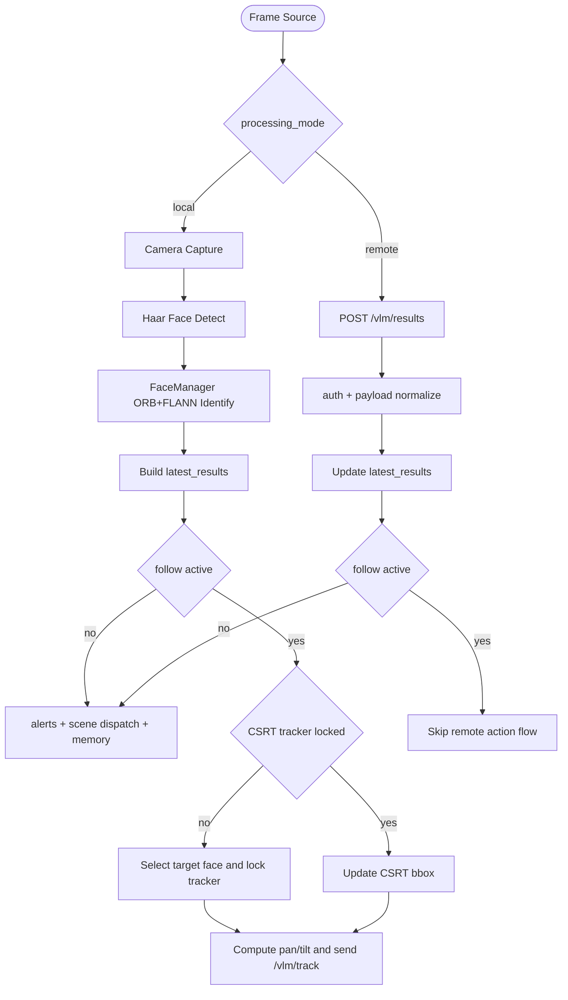

# VLM Bridge Modulu Mimarisi

VLM Bridge modulu (modules/vlm_bridge), goruntu tarafinda iki farkli calisma modelini yonetir:

- local: OpenCV ile yuz algilama + ORB/FLANN eslestirme + CSRT takip
- remote: dis istemciden gelen sonucu /vlm/results ile kabul etme

Ana hedef, "beni takip et" komutunda genel obje hattina degil dogrudan yuz kilidi ve takip akimina gecmektir.

## Is Akisi

## Bilesenler ve Sorumluluklar

- VisionProcessor:
    - kamera yakalama ve analiz dongusu
    - takip durum makinesi: start_follow, stop_follow, follow_status
    - CSRT lock/update ve pan-tilt surus cikisi
- FaceManager:
    - yuz ROI cikarma (Haar)
    - ORB descriptor uretimi
    - FLANN knn match + ratio test
    - descriptor tabanli kisiyi tanima/kayit
- PeopleMemory:
    - kisi bazli sohbet gecmisi ve ozet
- SemanticDescriber + VisionActionDispatcher:
    - local/remote sonuclari semantik metne cevirme
    - Autonomy apply_actions hattina etiketli aksiyon aktarma

## Takip Davranişi

1. follow/start cagrisi geldiginde takip modu aktif edilir.
2. Hedef kisi verilirse once o isimle eslesen yuz aranir; verilmezse ilk uygun yuz secilir.
3. CSRT kilidi kurulduktan sonra her dongude bbox merkezi hesaplanir.
4. Merkez sapmasi pan/tilt kazancina cevrilir ve limitler icinde kirpilir.
5. Komut cikisi once callback ile gateway/arduino hattina, callback yoksa /vlm/track endpointine gider.
6. Tracker ard arda kaybolursa lock dusurulur ve yeniden kilit aranir.

## If Else Karar Ozetleri

- if follow aktif degilse:
    - normal sahne akisi (alert, blind mode, action dispatch) calisir.
- if follow aktifse:
    - oncelik yuz kilidi + CSRT surdurmeye verilir.
    - remote ingest ile gelen genel obje aksiyonlari bastirilir.
- if target kisi taninmiyorsa:
    - takip auto aday secimi ile devam eder.
- if tanimli kisi ve cooldown uygunsa:
    - kisi etkileşimi/selamlama akisi tetiklenir.

## Veri ve Kalicilik

- faces.json:
    - kisi -> ORB descriptor listesi
- people_memory.json:
    - kisi -> sohbet satirlari, son ozet, last_seen

Bu yapiyla modül, YOLO veya face_recognition bagimliligi olmadan hafif bir yuz odakli takip ve kisi hafizasi sunar.
