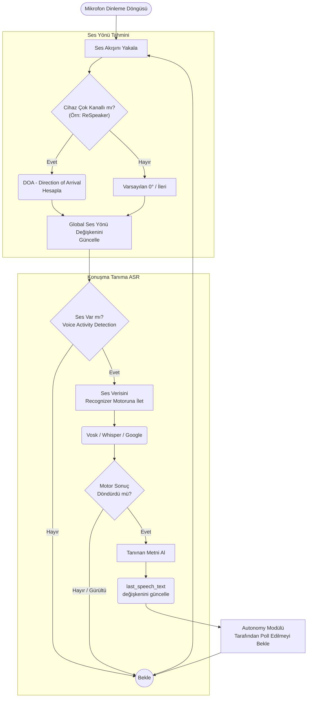
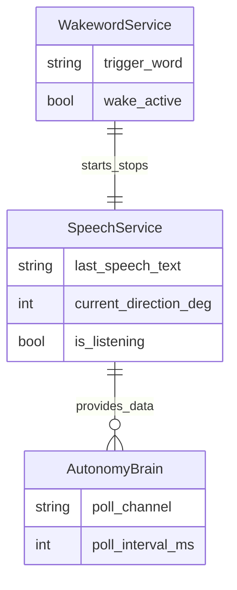

# Speech Modülü Mimarisi

Speech modülü (`modules/voice/speech`), mikrofon verisini alarak konuşma tanıma (ASR/STT) işlemi yapar ve sesin geliş yönünü (direction) tahmin eder.

## 🏗️ İş Akışı ve Karar Mekanizmaları (Flowchart)

## 🔄 İlişkisel Etkileşimler (Veri Akışı)

## ⚙️ Detaylı Karar Mantığı (if/else)

1. **Dinleme Durumu (Enable/Disable)**
   - **`if`** `is_listening == False`: Sensör mikrofonu okumayı bırakmaz ama STT (Speech-to-Text) motoruna göndermez (CPU tasarrufu).
   - Bu durum genelde `Wakeword` modülü tarafından yönetilir (Wakeword duyulunca `is_listening = True` yapılır).
2. **Ses Yönü Hesaplaması (DOA)**
   - **`if`** donanım özel 4-mikrofonlu bir array ise (ReSpeaker gibi), sesin gecikme farklarından (TDOA) açısı hesaplanır (`0 - 360` derece).
   - Bu veri `Autonomy` tarafından saniyede bir poll edilir. **`if`** açı değişimi eski açıdan 15 dereceden fazlaysa, Autonomy kafayı o yöne çevirir.
3. **Kısa/Gürültü Filtrelemesi**
   - **`if`** `len(text.strip()) < 3`: Sadece tek hecelik gürültüler veya öksürükler metin olarak kabul edilmez, silinir.
