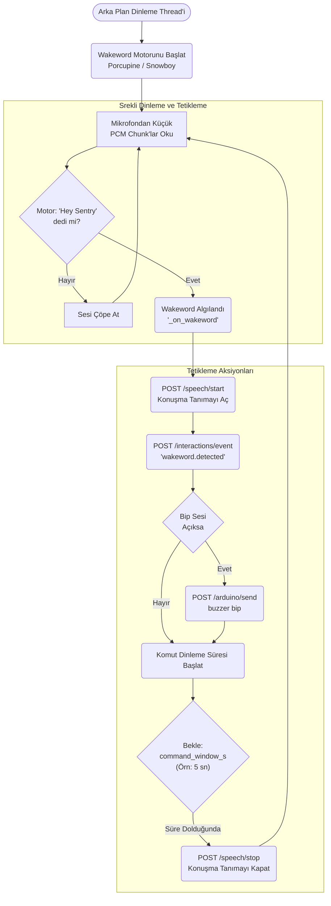

# Wakeword Modülü Mimarisi

Wakeword modülü (`modules/wakeword`), arka planda sürekli olarak dinleyerek robotun aktivasyon kelimesini (örn: "Hey Sentry", "Alexa", "Jarvis") algılayan düşük güç tüketimli bir tetikleyicidir.

## 🏗️ İş Akışı ve Karar Mekanizmaları (Flowchart)



## 🔄 İlişkisel Etkileşimler (Veri Akışı)

```mermaid
erDiagram
    WakewordService ||--|| SpeechService : activates
    WakewordService ||--o{"InteractionEngine : pushes_events
    WakewordService ||--o{ AutonomyBrain : updates_status
    
    WakewordService {
        string model_path
                int command_window_s
                _on_wakeword"}
    
    SpeechService {start
                stop}
```

## ⚙️ Detaylı Karar Mantığı (if/else)

1. **Dinleme Aktivasyonu (`_on_wakeword()`)**
   - Wakeword duyulduğunda, **`if`** `command_window_s > 0` (dinleme penceresi yapılandırılmışsa):
     - `Speech` motoruna bağlanarak metin dönüştürmeyi (ASR) aktif hale getirir. (Bu sayede mikrofon her saniye buluta / CPU ağır modellere ses yollamaz, sadece wakeword'den sonraki 5 saniye STT çalışır).
   - Ayrıca robotun uyandığını belli etmek için `Interactions` modülüne bir event basar. (Bu da LED'leri mavi yakıp söndürür).
2. **Kapatma Zamanlayıcısı (Timeout)**
   - `threading.Timer` başlatılır.
   - **`if`** 5 saniye içinde başka bir komut verilirse (Autonomy metni çoktan aldıysa) motor kapanır.
   - **`else`**: Süre dolsa bile komut bitmemişse bile acımasızca `Speech/Stop` çağrısı yaparak batarya ve CPU'yu korur.
