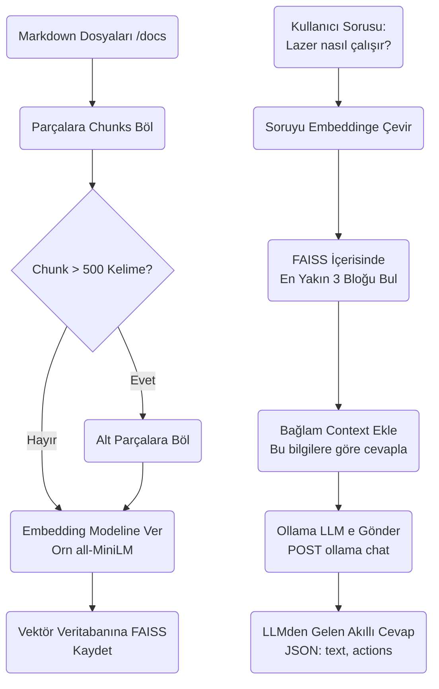

# Wiki RAG Modülü Mimarisi

Wiki RAG (Retrieval-Augmented Generation) modülü (`modules/wiki_rag`), SentryBOT'un Ollama yapay zekasını spesifik belgelerle (kullanım kılavuzu, Arduino devre şemaları vb.) besleyerek halüsinasyonları önleyen "Arama Motoru + LLM" eklentisidir.

## 🏗️ İş Akışı ve Karar Mekanizmaları (Flowchart)



## 🔄 İlişkisel Etkileşimler (Veri Akışı)

```mermaid
erDiagram
    WikiRagService ||--o{"FAISSDatabase : reads_writes
    WikiRagService ||--|| OllamaService : chains
    
    WikiRagService {
        embed_text_text
        search_similar_query__k
        chat_with_context_query"}
    
    FAISSDatabase {file index.faiss
        file metadata.json}
```

## ⚙️ Detaylı Karar Mantığı (if/else)

1. **Bağlam (Context) Geçerliliği (Distance/Score)**
   - Vektör Veritabanı aramasından dönen sonuçların ne kadar "yakın" veya alakalı olduğu L2 mesafesiyle ölçülür.
   - **`if`** dönen alaka skoru çok kötüyse (Örn: Lazer ile ilgili soru soruldu ama FAISS'te lazerle ilgili belge bulunamadı ve "Tekerlekler" kismı eşleşti): Sistemin saçmalamaması için RAG bu bağlamı LLM'e (`context=""`) eklemeyi reddeder. "Bununla ilgili veritabanımda bilgi yok" dedirtir.
2. **LLM Chain (Zinciri)**
   - RAG kendi başına cevap üretemez. Bulduğu bilgi kırıntılarını (`context`) alıp Autonomy'nin halihazırda kullandığı *hata yakalayıcı ve XML Tag çevirici* özellikleri olan orijinal **OllamaChatService** sistemine paslar. Bu sayede donanım hareketleri RAG açıkken bile kusursuz çalışır.
